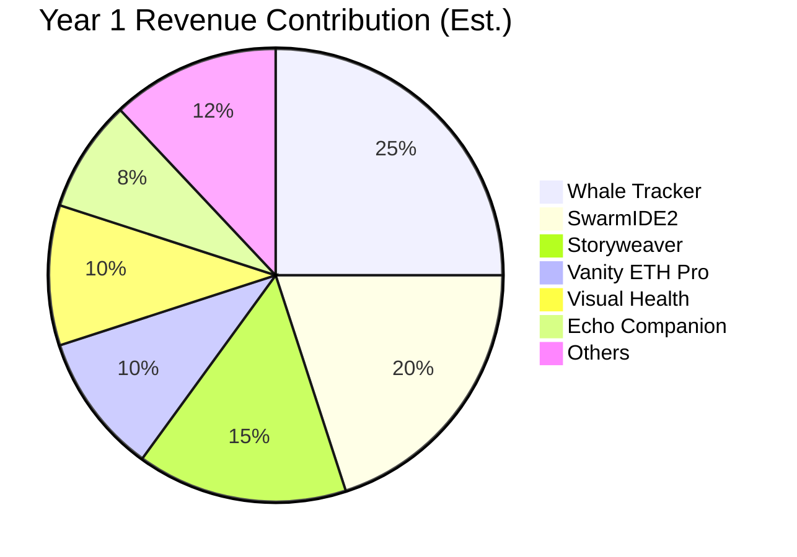
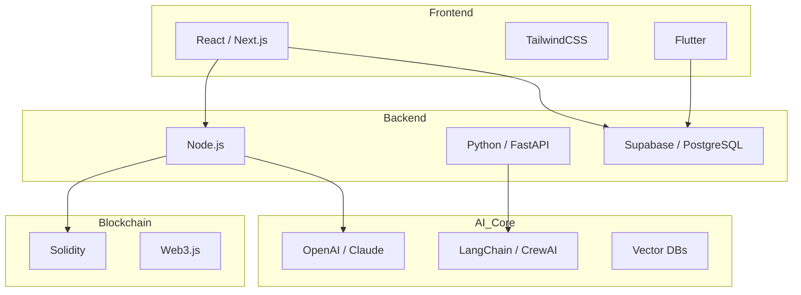

# AMP Portfolio: Enterprise Software Suite
## Executive Summary

The Amp Portfolio represents a sophisticated collection of **75+ high-value software assets** with a combined Total Addressable Market (TAM) exceeding **$15 Billion**. This diverse ecosystem spans Artificial Intelligence, Blockchain/DeFi, Enterprise SaaS, Healthcare, and Gaming sectors.

The portfolio is characterized by a strong focus on **monetization-ready architectures**, with multiple projects in "deploy-ready" or "near-ready" states. Our deep analysis indicates an immediate revenue potential of **$1.5M - $2M ARR within the first 12 months** from the top 12 projects alone, with a clear path to scaling via enterprise sales and B2B partnerships.

**Key Highlights:**
- **Immediate Revenue:** 3 Tier-1 projects ready for deployment this week.
- **High-Growth Potential:** 5 Tier-2 projects ready within 30 days.
- **Diverse Revenue Streams:** A balanced mix of Subscription (SaaS), Transaction Fees, and Licensing models.
- **Modern Tech Stack:** Built on scalable, industry-standard technologies (Next.js, Python/FastAPI, Solidity, Supabase).

---

## 🏆 Top 10 Monetization Potential

Based on market demand, implementation readiness, and revenue modeling, these are the highest-value assets in the portfolio:

| Rank | Project | Sector | Status | Est. Year 1 ARR |
| :-- | :--- | :--- | :--- | :--- |
| **1** | **Whale Tracker** | DeFi / Analytics | 🟢 Ready | **$1,000,000+** |
| **2** | **SwarmIDE2** | Enterprise AI / DevTools | 🟡 Near-Ready | **$2,000,000+** |
| **3** | **Vanity ETH Pro** | Crypto / Privacy | 🟢 Ready | **$500k - $2M** |
| **4** | **Storyweaver** | AI Content / Publishing | 🟡 Near-Ready | **$500k - $3M** |
| **5** | **Visual Health Companion** | HealthTech / B2B | 🟡 Near-Ready | **$300k - $1M** |
| **6** | **Echo Companion** | EdTech / Mental Health | 🟡 Near-Ready | **$500k - $1M** |
| **7** | **Sonic Brand AI** | B2B Marketing | 🟢 Ready | **$200k - $500k** |
| **8** | **CoreDNA2** | B2B SaaS / Design | 🟠 High Potential | **$500k+** |
| **9** | **Vibe Coder** | DevTools / AI | 🟠 High Potential | **$1,000,000+** |
| **10** | **Cassandra Oracle** | Enterprise AI / Data | 🟠 High Potential | **$500k+** |

---

## 📂 Portfolio Breakdown

### 🤖 Artificial Intelligence (AI) & Agents
*Leader: SwarmIDE2*
- **SwarmIDE2:** Multi-agent orchestration for enterprise.
- **Storyweaver:** AI-driven book and content generation.
- **Echo Companion:** AI language tutor and mental health companion.
- **AICouncil:** Neural hivemind for governance.

### ⛓️ Blockchain & DeFi
*Leader: Whale Tracker*
- **Whale Tracker:** Real-time large transaction monitoring.
- **Vanity ETH Pro:** Custom address generation.
- **World Dutch Auctions:** Decentralized auction protocols.
- **Cassandra Oracle:** Blockchain prediction engine.

### 🛠️ Developer Tools & SaaS
*Leader: Vibe Coder*
- **Vibe Coder:** AI code generation assistant.
- **Clip Forge:** Short-form video creation for creators.
- **CloakSeed:** Security and seed phrase management.

### 🎮 Gaming & Interactive
*Leader: GamerWingman*
- **GamerWingman:** AI coaching and companion for gamers.
- **Mythics NPC Forge:** AI NPC generation for game devs.
- **AseMirror:** Cultural/Tech interactive mirror.

---

## 🏗️ Technical Stack Overview

The portfolio utilizes a modern, cohesive technology stack designed for scalability and rapid deployment.

### Core Technologies
- **Frontend:** React, Next.js, TailwindCSS, Flutter (Mobile)
- **Backend:** Node.js (Express), Python (FastAPI/Django)
- **Database:** Supabase (PostgreSQL), Firebase
- **AI/ML:** OpenAI API, Anthropic Claude, LangChain, CrewAI
- **Blockchain:** Solidity, Web3.js, Ethers.js, Hardhat

---

## 📊 Visualizations

### Portfolio Revenue Projection (Year 1)

### Technology Stack Distribution

