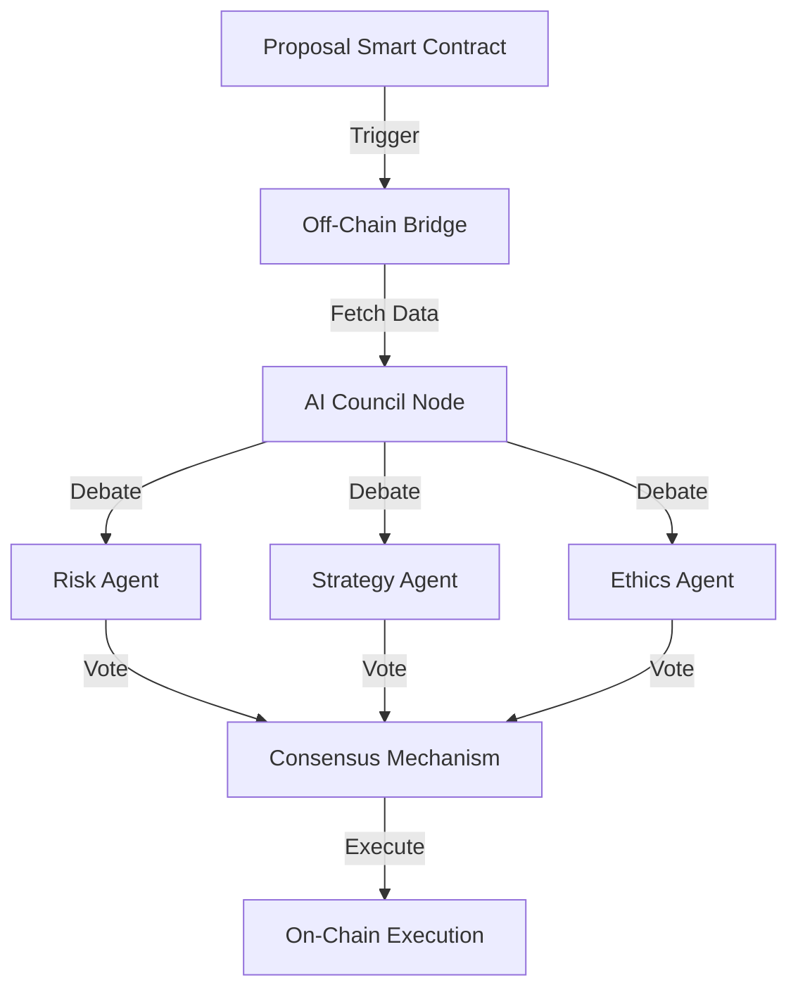
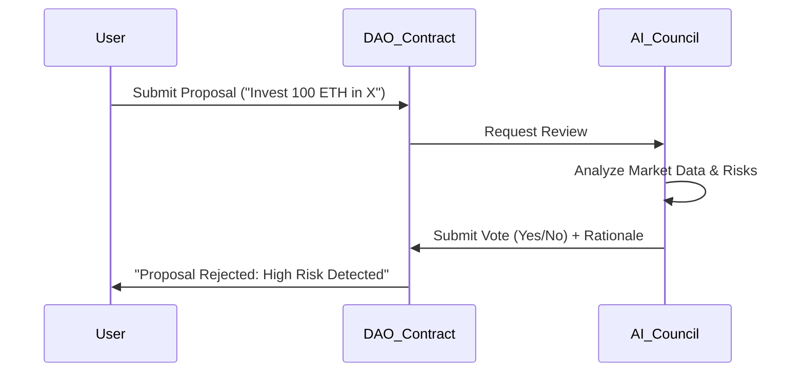

# Project Report: AICouncil

## 1. Executive Summary
**Status:** 🟠 Strategic Asset (Blockchain Neural Hivemind)
**Sector:** AI Governance / DAO
**Est. Year 1 Revenue:** Strategic Value / Tokenomics

AICouncil is a decentralized governance framework where multiple AI agents act as council members to vote on proposals, manage treasuries, or oversee protocol upgrades. It represents the convergence of AI and DAO governance, ensuring objective, data-driven decision-making for blockchain protocols.

## 2. Monetization Strategy
B2B Governance as a Service (GaaS) & Tokenomics.

*   **Protocol Fees:** 1-2% fee on all treasury assets managed by the Council.
*   **Licensing:** Protocols pay to integrate AICouncil for automated risk management.
*   **Token:** Governance token for electing AI model parameters.

## 3. Technical Architecture

## 4. User Flow

## 5. Market Potential
*   **TAM:** $10B+ (DAO Treasuries).
*   **Target Audience:** DeFi Protocols, DAOs, Investment Funds.
*   **Innovation:** Removes human emotional bias from financial governance.

## 6. Next Steps
1.  **Whitepaper:** Publish the technical paper on "AI-Driven Consensus".
2.  **Pilot:** Partner with a mid-sized DAO for a governance test run.
3.  **Audit:** Full security audit of the bridge contracts.
