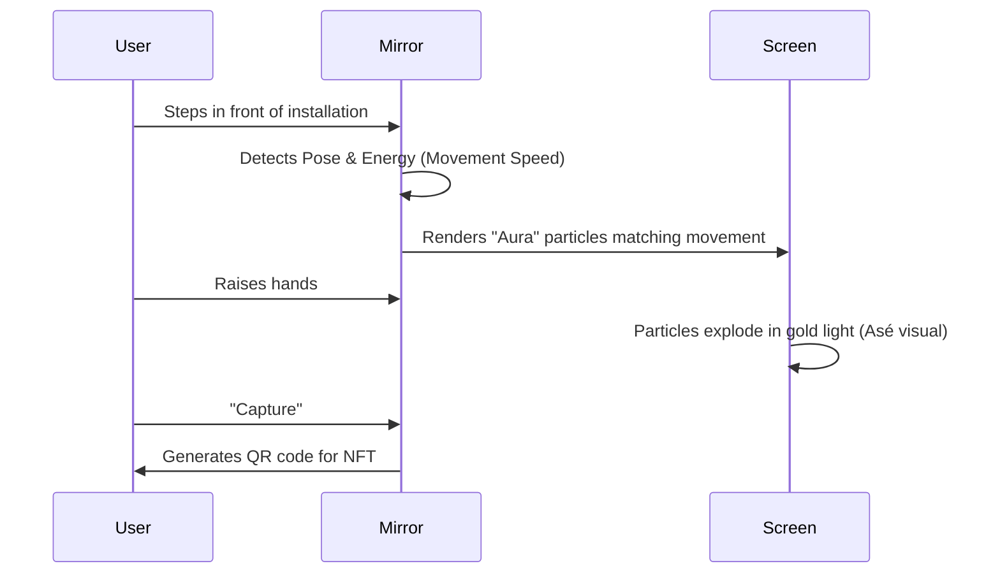

# Project Report: AseMirror

## 1. Executive Summary
**Status:** 🟡 Prototype / Art-Tech
**Sector:** Interactive Tech / Culture
**Est. Year 1 Revenue:** $50k - $150k

AseMirror is an interactive digital installation and web experience that uses computer vision and AR to reflect the user's "digital aura." Inspired by the Yoruba concept of "Asé" (power to make things happen), it visualizes user intent and movement as generative art. It bridges the gap between ancient cultural concepts and modern immersive tech.

## 2. Monetization Strategy
Licensing & Installations.

*   **Web App:** Free (Brand awareness).
*   **Event Installation:** $5,000 - $15,000 per event (Museums, Festivals, Tech Conferences).
*   **NFT Art:** Users can mint their "Mirror Reflection" as a unique NFT.

## 3. Technical Architecture

```mermaid
graph TD
    Camera[Webcam / Kinect] -->|Stream| CV[Pose Estimation (MediaPipe)]
    CV -->|Vector Data| GenArt[Generative Engine (p5.js / Three.js)]
    GenArt -->|Render| Display[Screen / Projection]
    User -->|Interact| Camera
    GenArt -->|Mint| Blockchain[NFT Contract]
```

## 4. User Flow



## 5. Market Potential
*   **TAM:** $50B (Digital Art & Experiential Marketing).
*   **Target Audience:** Museums, Art Galleries, Music Festivals, Cultural Brands.
*   **Unique Angle:** "Afrofuturism" meets "Creative Coding."

## 6. Next Steps
1.  **Demo:** Create a high-quality video trailer of the installation.
2.  **Portfolio:** Secure a pilot installation at a local gallery or tech meetup.
3.  **Optimization:** Ensure web version runs smoothly on mobile devices.
