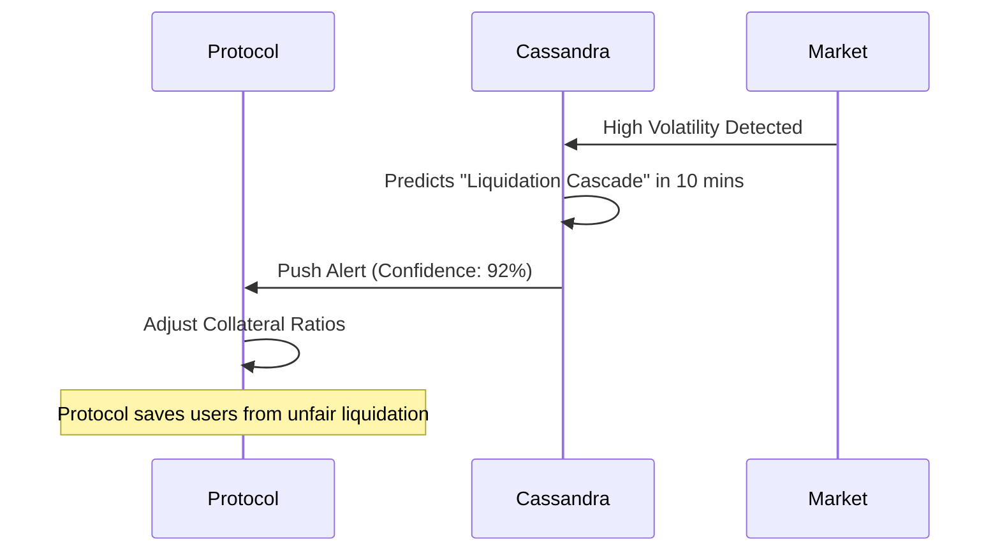

# Project Report: Cassandra Oracle

## 1. Executive Summary
**Status:** 🟠 High Potential (Production Ready)
**Sector:** Blockchain / Enterprise AI
**Est. Year 1 Revenue:** $500k+

Cassandra Oracle is a predictive analytics engine for blockchain networks. Unlike standard oracles that provide *current* data (price feeds), Cassandra uses ML models to provide *predictive* data (future volatility, gas price spikes, liquidation risks). This enables DeFi protocols to be proactive rather than reactive.

## 2. Monetization Strategy
B2B Data Licensing.

*   **Feed Subscription:** Protocols pay tokens to consume specific data feeds.
*   **Enterprise API:** $2,000/mo for high-frequency predictive data.
*   **Staking:** Node operators stake tokens to provide computation.

## 3. Technical Architecture

```mermaid
graph TD
    Sources[Off-Chain Data (Exchanges/News)] -->|Ingest| Node[Oracle Node]
    Node -->|ML Model| Prediction[Prediction Engine]
    Prediction -->|Result| Contract[Smart Contract]
    Contract -->|Publish| Chain[Blockchain Network]
    DeFi[DeFi Protocol] -->|Read| Chain
```

## 4. User Flow



## 5. Market Potential
*   **TAM:** $2B (Blockchain Data & Oracle Services).
*   **Target Audience:** Lending Protocols (Aave, Compound), Stablecoin Issuers.
*   **Value:** Preventing a single flash crash can save a protocol millions, making the subscription cost negligible.

## 6. Next Steps
1.  **Backtesting:** Publish a report showing model accuracy on historical data.
2.  **Integration:** Build adapters for Chainlink or API3.
3.  **Sales:** Pitch to 3 major lending protocols as a "Risk Management Layer".
