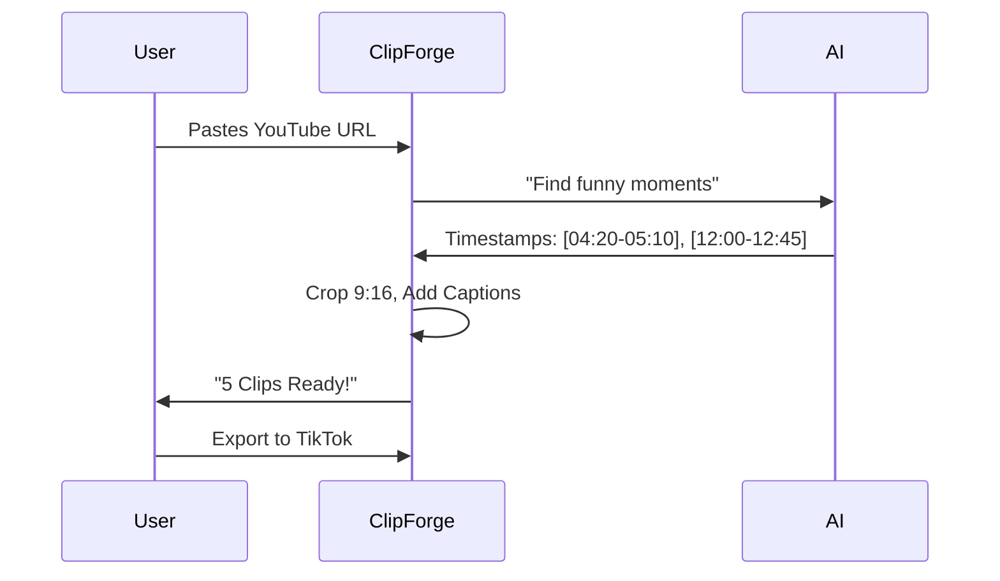

# Project Report: ClipForge

## 1. Executive Summary
**Status:** 🟠 High Potential (MVP Complete)
**Sector:** Creator Economy / SaaS
**Est. Year 1 Revenue:** $50k - $300k

ClipForge is an AI-powered video repurposing tool. It automatically ingests long-form content (YouTube videos, Podcasts) and uses AI to identify viral moments, generating short-form clips (TikTok/Reels/Shorts) complete with auto-captions and "retention editing" styles.

## 2. Monetization Strategy
Prosumer SaaS.

*   **Free:** 1 hour of processing/month (watermarked).
*   **Creator ($19/mo):** 10 hours, no watermark, 4k export.
*   **Agency ($99/mo):** Bulk processing, custom branding templates.

## 3. Technical Architecture

```mermaid
graph TD
    User[Creator] -->|URL| Backend[Node.js Server]
    Backend -->|Download| YouTube[YouTube DL]
    Backend -->|Transcribe| Whisper[OpenAI Whisper]
    Backend -->|Analyze| LLM[LLM (Viral Scoring)]
    Backend -->|Edit| FFMPEG[FFmpeg Engine]
    FFMPEG -->|Clips| Storage[Cloud Storage]
    Storage -->|Download| User
```

## 4. User Flow



## 5. Market Potential
*   **TAM:** $100B (Creator Economy).
*   **Target Audience:** YouTubers, Streamers, Podcasters.
*   **Demand:** Short-form video is the #1 growth driver for social platforms.

## 6. Next Steps
1.  **Beta:** Onboard 50 creators for free to stress-test the FFmpeg rendering.
2.  **Templates:** Add "Alex Hormozi style" caption templates.
3.  **Marketing:** Create "ClipForge vs Manual Editing" comparison videos.
