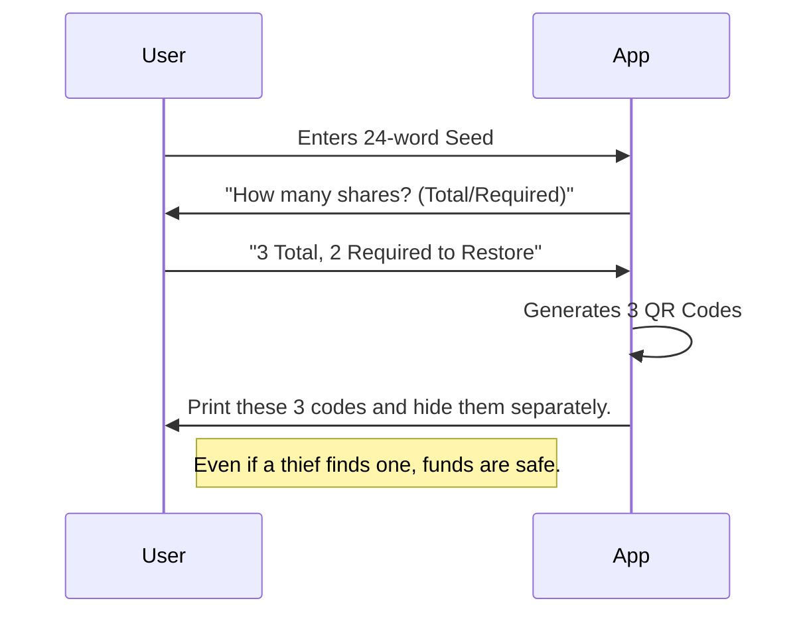

# Project Report: CloakSeed

## 1. Executive Summary
**Status:** 🟡 Near-Ready (Security Tool)
**Sector:** Crypto Security / Privacy
**Est. Year 1 Revenue:** $20k - $100k

CloakSeed is a secure, non-custodial tool for splitting and obfuscating cryptocurrency seed phrases. Using Shamir's Secret Sharing (SSS) and steganography, it allows users to hide parts of their private keys within innocuous digital files (images, audio) or split them across multiple physical locations, ensuring no single point of failure.

## 2. Monetization Strategy
Freemium Utility + Hardware Upsell.

*   **App:** Free (Basic SSS splitting).
*   **Pro ($29 one-time):** Steganography features (Hide in image) + Cloud Backup (Encrypted).
*   **Physical:** Selling "CloakSeed" steel backup plates (Affiliate/Dropship).

## 3. Technical Architecture

```mermaid
graph TD
    User[User] -->|Input Seed| App[Local Client (WASM)]
    App -->|Shamir Split| Shards[Shard 1, Shard 2, Shard 3]
    Shards -->|Embed| Stego[Steganography Engine]
    Stego -->|Output| Files[Image.png / Audio.wav]
    User -->|Store| USB[USB Drive / Cloud]
```

## 4. User Flow



## 5. Market Potential
*   **TAM:** $500M (Crypto Security Hardware/Software).
*   **Target Audience:** HODLers, Crypto Whales, Security-conscious investors.
*   **Niche:** Fills the gap between writing on paper and buying expensive hardware wallets.

## 6. Next Steps
1.  **Audit:** Open-source the cryptographic core for community review.
2.  **UI:** Build a clean, "hacker-proof" looking UI.
3.  **Launch:** Product Hunt launch focused on "Self-Custody made safe".
