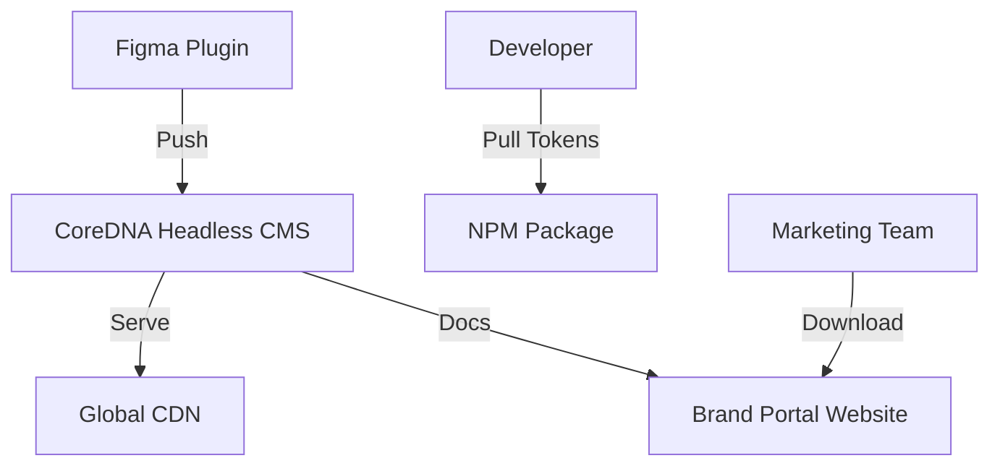
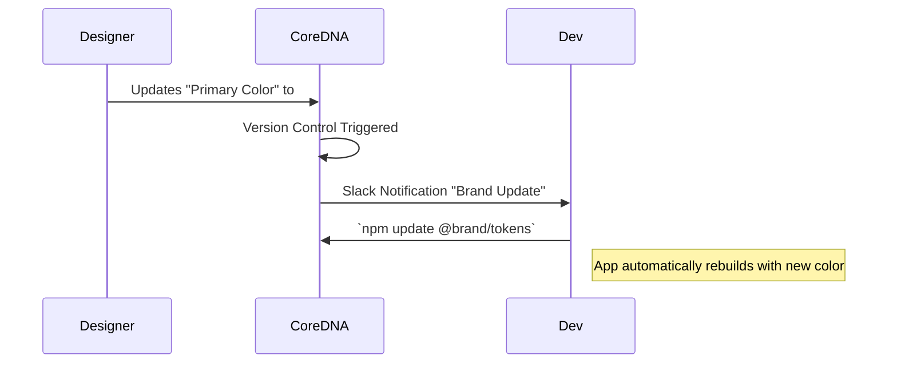

# Project Report: CoreDNA2

## 1. Executive Summary
**Status:** 🟠 High Potential (Production Ready)
**Sector:** B2B SaaS / Design
**Est. Year 1 Revenue:** $500k+

CoreDNA2 is a comprehensive brand management and design system platform. It serves as a "single source of truth" for a company's visual identity, storing assets, guidelines, and code snippets (React/Vue components). It bridges the gap between designers (Figma) and developers (Code), ensuring brand consistency at scale.

## 2. Monetization Strategy
B2B SaaS.

*   **Team:** $29/mo per user.
*   **Agency:** $99/mo (Manage multiple client brands).
*   **Enterprise:** Custom pricing (SSO, Audit Logs, On-premise options).

## 3. Technical Architecture

## 4. User Flow

## 5. Market Potential
*   **TAM:** $10B (Creative Software & DAM).
*   **Target Audience:** Design Agencies, Scale-ups, Remote Teams.
*   **Problem Solved:** Eliminates "brand drift" and outdated assets in production code.

## 6. Next Steps
1.  **Launch:** Public release of the Figma plugin.
2.  **Marketing:** Content marketing focused on "Design Systems Ops".
3.  **Sales:** Direct outreach to agencies managing 10+ brands.
