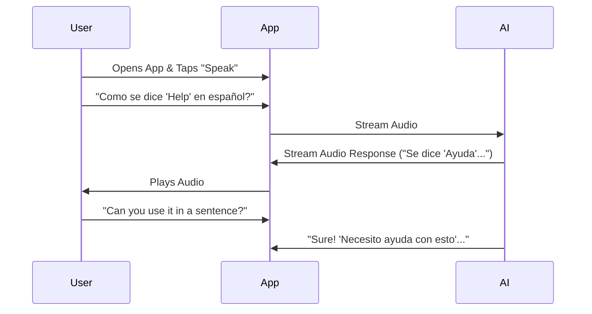

# Project Report: Echo Companion

## 1. Executive Summary
**Status:** 🟡 Near-Ready (MVP Complete)
**Sector:** EdTech / Mental Health
**Est. Year 1 Revenue:** $500k - $1M

Echo Companion is a mobile-first application designed for real-time language learning and mental wellness support. Utilizing Grok Realtime API, it offers voice-to-voice interaction that mimics natural human conversation. The app integrates with RevenueCat for subscription management and is positioned to disrupt the language learning market with its "always-on" AI tutor.

## 2. Monetization Strategy
B2C Mobile Subscription Model (via App Store/Google Play).

*   **Free:** 50 minutes of conversation/month.
*   **Pro ($9.99/mo):** Unlimited conversation, offline mode, and accent training.
*   **Elite ($19.99/mo):** Specialized lessons (Business, Medical) and ad-free experience.

## 3. Technical Architecture

```mermaid
graph TD
    Mobile[Mobile App (Flutter)] -->|Voice Stream| Edge[Edge Server]
    Edge -->|WebSocket| API[Grok Realtime API]
    API -->|Response| Edge
    Edge -->|Audio| Mobile
    Mobile -->|User Data| Supabase[(Supabase DB)]
    Mobile -->|Subscription| RevCat[RevenueCat]
```

## 4. User Flow



## 5. Market Potential
*   **TAM:** $60B (Language Learning) + $5B (Mental Health Apps).
*   **Target Audience:** Language learners, travelers, individuals seeking low-barrier social interaction.
*   **Advantage:** Real-time voice latency (<500ms) creates a truly immersive experience compared to text-based competitors.

## 6. Next Steps
1.  **Deploy:** Submit iOS and Android builds for review.
2.  **Marketing:** Launch TikTok campaign demonstrating "Real-time Translation" features.
3.  **ASO:** Optimize App Store screenshots and keywords.
