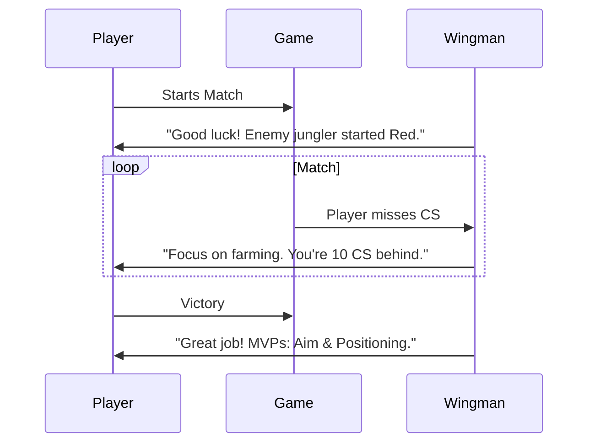

# Project Report: GamerWingman

## 1. Executive Summary
**Status:** 🟡 Near-Ready (MVP)
**Sector:** Gaming / AI
**Est. Year 1 Revenue:** $100k - $500k

GamerWingman is an AI-powered coaching companion that runs alongside competitive games (League of Legends, Valorant, etc.). Using computer vision and game API data, it provides real-time tactical advice, enemy tracking, and post-game performance analysis to help players climb the ranked ladder.

## 2. Monetization Strategy
Subscription & Microtransactions.

*   **Free:** Basic post-game stats.
*   **Pro ($7.99/mo):** Real-time in-game overlay and live coaching.
*   **Coaching Marketplace:** Connect with human pros for deep-dive reviews (Platform fee: 20%).

## 3. Technical Architecture

```mermaid
graph TD
    Game[Game Client] -->|Screen/Logs| Capture[Capture Service]
    Capture -->|Frame Data| CV_Engine[Computer Vision (YOLO)]
    CV_Engine -->|Events| Logic[Coaching Logic]
    Logic -->|Advice| Overlay[In-Game Overlay]
    Logic -->|Stats| Cloud[Cloud Database]
    Cloud -->|Analysis| Web[User Dashboard]
```

## 4. User Flow



## 5. Market Potential
*   **TAM:** $200B (Global Gaming Market).
*   **Target Audience:** Competitive gamers (eSports hopefuls), Streamers.
*   **Growth:** "Coaching" is a massive niche within the gaming ecosystem.

## 6. Next Steps
1.  **Compatibility:** Verify anti-cheat compliance (Vanguard, RICOCHET).
2.  **Beta:** Release closed beta for 1,000 Valorant players.
3.  **Partnerships:** Sponsor 5 mid-tier Twitch streamers.
