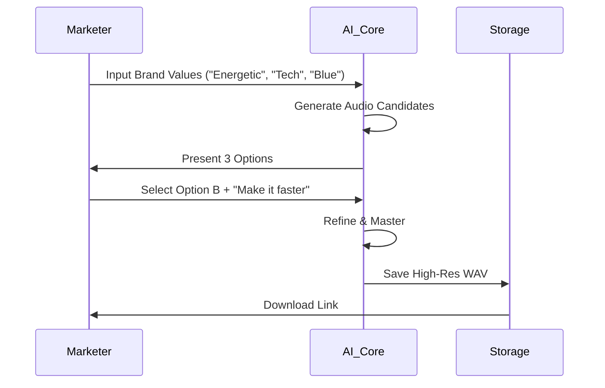

# Project Report: Sonic Brand AI

## 1. Executive Summary
**Status:** 🟢 Ready (Backend Complete)
**Sector:** B2B Marketing / AI
**Est. Year 1 Revenue:** $200k - $500k

Sonic Brand AI automates the creation of "audio logos" and brand identities using generative AI. It helps companies establish a consistent auditory brand across all touchpoints (videos, podcasts, apps). With a completed backend and high-margin B2B model, it addresses a growing need in the digital marketing space.

## 2. Monetization Strategy
Pure B2B SaaS model targeting agencies and startups.

*   **Startup Tier:** $99/mo (5 assets/month).
*   **Agency Tier:** $499/mo (25 assets + White Label).
*   **Enterprise:** Custom Licensing (Unlimited generation).

## 3. Technical Architecture

```mermaid
graph TD
    Dashboard[Web Dashboard] -->|Request| API[API Gateway]
    API -->|Prompt| LLM[LLM (Context Gen)]
    LLM -->|Parameters| AudioModel[Audio Gen Model (MusicGen/AudioLDM)]
    AudioModel -->|Raw Audio| Processor[Post-Processing (FFmpeg)]
    Processor -->|Final Asset| Storage[(Supabase Storage)]
    Storage -->|Link| Dashboard
```

## 4. User Flow



## 5. Market Potential
*   **TAM:** $2B (Digital Audio Advertising Market)
*   **Target Audience:** Marketing Agencies, Podcasters, YouTube Creators.
*   **Trends:** "Sonic Branding" is a rising trend as visual space becomes saturated.

## 6. Next Steps
1.  **Frontend:** Build a sleek, waveform-visualizing dashboard.
2.  **Showcase:** Generate 50 demo samples for the landing page.
3.  **Outreach:** Cold email 100 digital agencies with a "free brand audit" offer.
