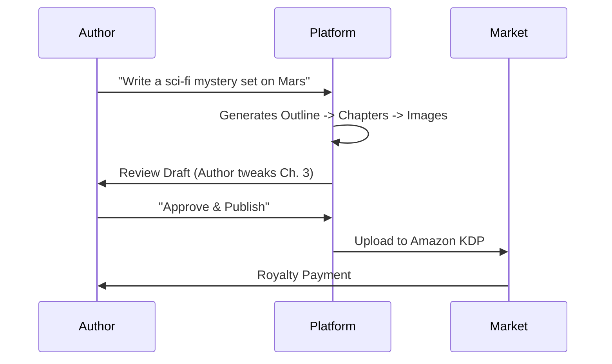

# Project Report: Storyweaver

## 1. Executive Summary
**Status:** 🟡 Near-Ready (70% Complete)
**Sector:** AI Content / Publishing
**Est. Year 1 Revenue:** $500k - $3M

Storyweaver is an end-to-end platform for AI-assisted book creation. It orchestrates a "crew" of AI agents (Writer, Editor, Illustrator, Formatter) to turn a simple prompt into a publish-ready eBook or Audiobook. It uniquely integrates with Kindle Direct Publishing (KDP) workflows, allowing users to monetize their creations instantly.

## 2. Monetization Strategy
Hybrid Subscription + Marketplace model.

*   **Creator Subscription:** $19.99/mo for unlimited book generation.
*   **Publisher Tier:** $49.99/mo for advanced formatting and royalty analytics.
*   **Marketplace:** Platform takes 30% commission on books sold directly through the Storyweaver store.

## 3. Technical Architecture

```mermaid
graph TD
    User[Author] -->|Prompt| API[Orchestrator]
    API -->|Draft| Writer[Writer Agent (Claude)]
    Writer -->|Review| Editor[Editor Agent (GPT-4)]
    Editor -->|Scene Desc| Art[Stable Diffusion]
    Editor -->|Text| TTS[Piper TTS (Audiobook)]
    Art & TTS -->|Package| EPUB[EPUB/MP3 Generator]
    EPUB -->|Publish| Kindle[KDP Integration]
```

## 4. User Flow



## 5. Market Potential
*   **TAM:** $100B+ (Global Publishing Industry).
*   **Target Audience:** Aspiring authors, content marketers, educators.
*   **Trend:** "AI-generated content" is the fastest-growing segment in digital publishing.

## 6. Next Steps
1.  **Marketplace:** Finalize the user-to-user sales platform.
2.  **Integrations:** Complete the automated Kindle upload script.
3.  **Community:** Launch a Discord server for "Storyweaver Authors" to share tips.
