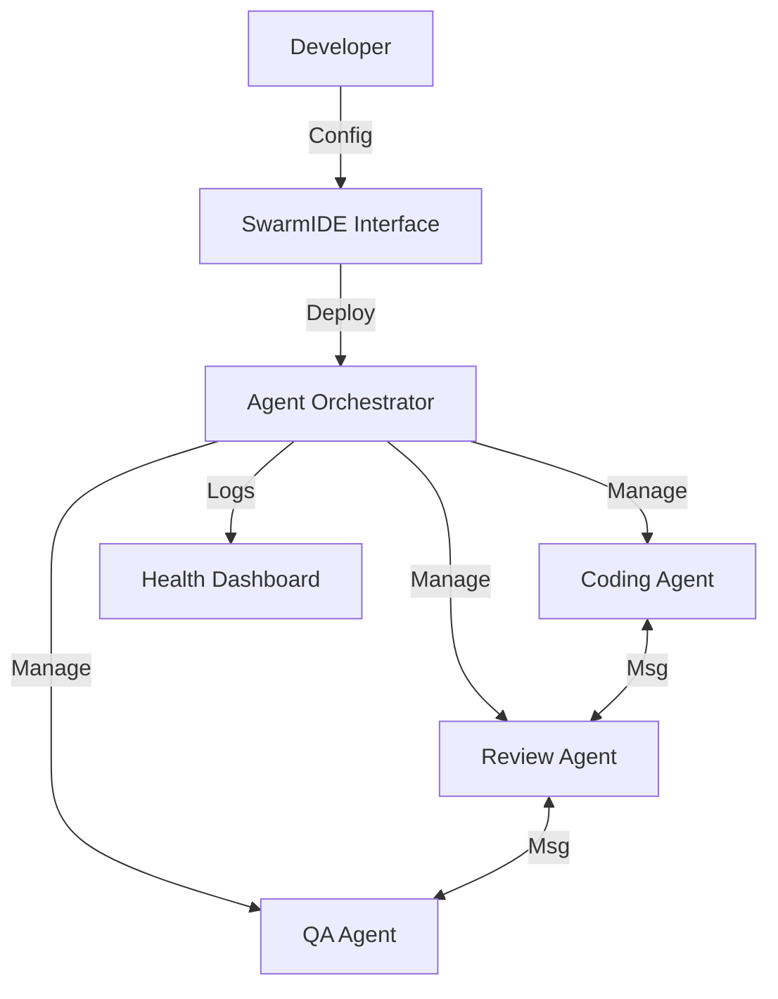
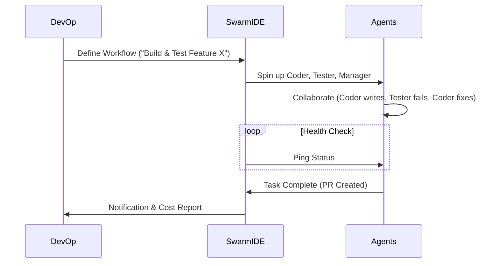

# Project Report: SwarmIDE2

## 1. Executive Summary
**Status:** 🟡 Near-Ready (Production Ready Code)
**Sector:** Enterprise AI / DevTools
**Est. Year 1 Revenue:** $2,000,000+

SwarmIDE2 is a cutting-edge multi-agent orchestration platform designed for enterprise environments. It allows teams to manage, deploy, and monitor multiple autonomous AI agents simultaneously. With conflict resolution, context compression, and health monitoring built-in, it solves the "orchestration gap" currently facing AI adoption in large companies.

## 2. Monetization Strategy
High-ticket Enterprise SaaS.

*   **Pro:** $499/mo (Small teams, up to 10 agents).
*   **Enterprise:** $2,000 - $10,000/mo (Custom deployment, SLA, SSO).
*   **Usage:** Passthrough API costs + 20% margin.

## 3. Technical Architecture

## 4. User Flow

## 5. Market Potential
*   **TAM:** $5B+ (DevOps & AI Orchestration)
*   **Target Audience:** Fortune 500 AI Teams, Software Houses, Startups.
*   **Advantage:** First-mover advantage in *visual* agent management.

## 6. Next Steps
1.  **Documentation:** Finalize API docs for enterprise integration.
2.  **Security:** Conduct a basic penetration test (required for enterprise sales).
3.  **Sales:** Create a "Book a Demo" funnel for high-ticket closing.
