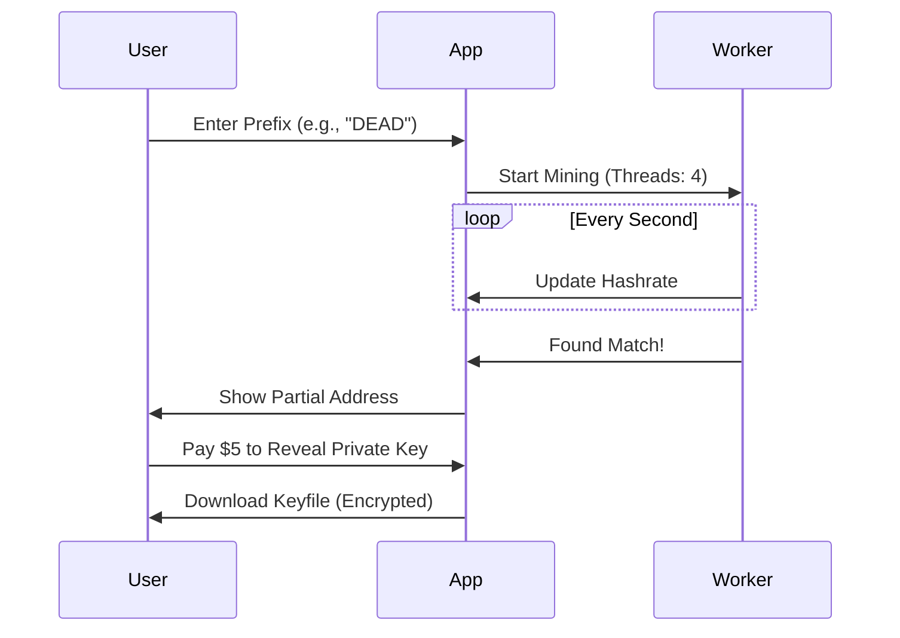

# Project Report: Vanity ETH Pro

## 1. Executive Summary
**Status:** 🟢 Ready (Frontend 60% Complete)
**Sector:** Crypto / Privacy
**Est. Year 1 Revenue:** $500k - $2M

Vanity ETH Pro is a high-performance, browser-based tool for generating custom Ethereum addresses (e.g., `0xAB...`). Unlike competitors that require command-line knowledge or trust in centralized servers, this tool uses client-side Web Workers for security and speed. It targets the privacy-conscious and aesthetic-driven crypto user base.

## 2. Monetization Strategy
Combines one-time purchases with subscription capabilities for power users.

*   **Pay-Per-Address:** $2 - $10 per generated address (depending on difficulty).
*   **Subscription (Pro):** $9.99/month for unlimited generation speed (GPU acceleration access).
*   **Enterprise:** White-label API for wallets to offer vanity generation.

## 3. Technical Architecture

```mermaid
graph TD
    Client[Browser Client] -->|React| UI[User Interface]
    UI -->|Start| Worker[Web Worker (WASM)]
    Worker -->|Generate| KeyPair[Key Pair Generation]
    KeyPair -->|Match?| Validator
    Validator -->|Yes| UI
    UI -->|Payment| Stripe
    Stripe -->|Confirm| Delivery
```

## 4. User Flow



## 5. Market Potential
*   **TAM:** $200M+ (Niche Crypto Tooling)
*   **Target Audience:** Crypto enthusiasts, DAO organizers, Project founders.
*   **USP:** Zero-trust architecture (keys never leave the browser) + superior UX.

## 6. Next Steps
1.  **Frontend:** Complete the remaining 40% of the React UI.
2.  **Payments:** Finalize Stripe integration for "pay-to-reveal" logic.
3.  **Marketing:** Post on r/ethereum and CryptoTwitter.
