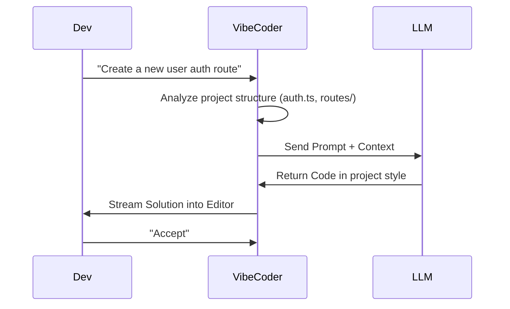

# Project Report: Vibe Coder

## 1. Executive Summary
**Status:** 🟠 High Potential (Production Ready)
**Sector:** Developer Tools / AI
**Est. Year 1 Revenue:** $1,000,000+

Vibe Coder is an intelligent, context-aware coding assistant that goes beyond simple autocompletion. It indexes entire codebases to understand project "vibe" (conventions, patterns, and architecture) and generates idiomatic code. It positions itself as a privacy-focused, highly customizable alternative to GitHub Copilot.

## 2. Monetization Strategy
SaaS Subscription.

*   **Developer:** $15/mo (Personal use).
*   **Team:** $50/user/mo (Shared context, private cloud).
*   **Enterprise (Self-Hosted):** $500/user/yr (Complete data sovereignty).

## 3. Technical Architecture

```mermaid
graph TD
    IDE[VS Code Extension] -->|Context| Agent[AI Agent (Local/Cloud)]
    Agent -->|Query| VectorDB[Vector Database (Chroma)]
    Agent -->|Inference| LLM[LLM (Llama 3 / GPT-4)]
    VectorDB <-->|Index| Codebase[Project Files]
    Agent -->|Suggestion| IDE
```

## 4. User Flow



## 5. Market Potential
*   **TAM:** $5B+ (AI Developer Tools).
*   **Target Audience:** Software Engineers, Tech Leads, Security-conscious Enterprises.
*   **Key Differentiator:** "Vibe" matching—it doesn't just write code; it writes *your* code.

## 6. Next Steps
1.  **Extension:** Publish the VS Code extension to the marketplace.
2.  **Performance:** Optimize vector indexing speed for large repos.
3.  **Community:** Launch a beta for 500 developers to gather feedback.
