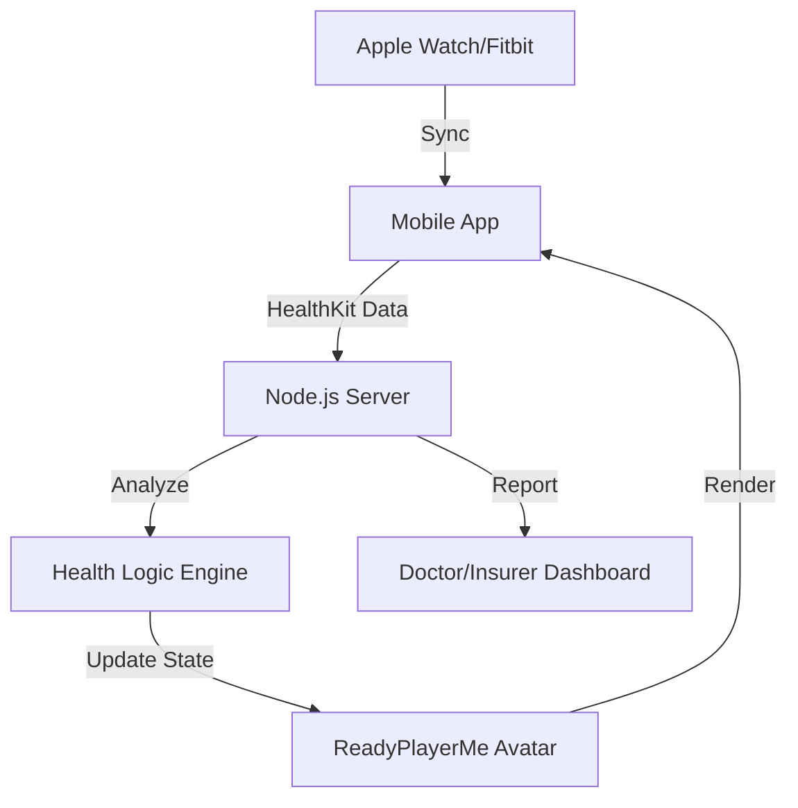
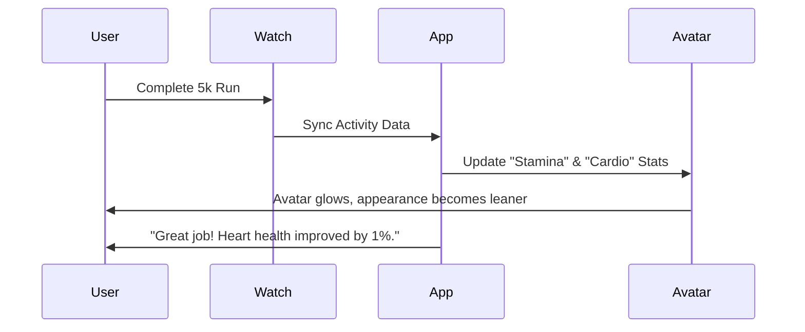

# Project Report: Visual Health Companion

## 1. Executive Summary
**Status:** 🟡 Near-Ready (80% Complete)
**Sector:** HealthTech / B2B
**Est. Year 1 Revenue:** $300k - $1M

Visual Health Companion creates a digital twin of the user's health status. Integrating with wearables (Apple Health, Google Fit), it visualizes health metrics on a 3D avatar—showing "damage" or "vitality" based on real-world data. It gamifies wellness and offers a compelling visual feedback loop for patients and fitness enthusiasts.

## 2. Monetization Strategy
B2B Enterprise + B2C Subscription.

*   **Consumer:** $14.99/mo for the app and avatar customization.
*   **Enterprise (B2B):** Licensing to Insurance companies and Corporate Wellness programs ($50k+ contracts) to reduce claimant risk.
*   **Family Plan:** $24.99/mo for up to 5 profiles.

## 3. Technical Architecture

## 4. User Flow

## 5. Market Potential
*   **TAM:** $500B (Global Digital Health).
*   **Target Audience:** Insurers (churn reduction), Gyms, Health-conscious individuals.
*   **Retention:** Visual feedback loops increase user retention by up to 40% compared to number-based apps.

## 6. Next Steps
1.  **Sales:** Initiate pilot program discussions with 3 mid-sized insurance providers.
2.  **Compliance:** Ensure HIPAA compliance for data storage.
3.  **Polish:** Smooth out avatar animations and texture loading.
