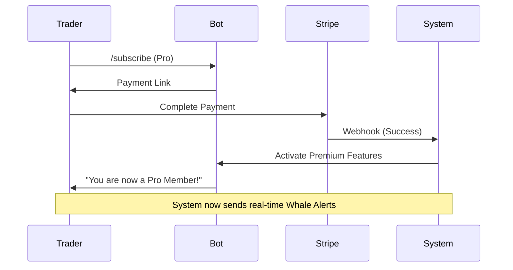

# Project Report: Whale Tracker

## 1. Executive Summary
**Status:** 🟢 Production Ready (MVP Complete)
**Sector:** DeFi / Analytics
**Est. Year 1 Revenue:** $1,000,000+

Whale Tracker is a real-time blockchain analytics tool designed to monitor large cryptocurrency transactions ("whale" movements). It provides actionable intelligence to traders via Discord and Telegram bots, enabling them to react to market-moving events before the general public. With the backend, payment processing (Stripe), and database (Supabase) fully implemented, it is ready for immediate deployment.

## 2. Monetization Strategy
The project utilizes a tiered Freemium SaaS model with high conversion potential due to the time-sensitive nature of the data.

*   **Freemium:** 5 free alerts/day (Lead Gen)
*   **Pro Subscription:** $19/month for unlimited alerts and custom thresholds.
*   **Enterprise API:** $99/month for programmatic access (Hedge funds, algorithmic traders).

## 3. Technical Architecture

```mermaid
graph TD
    User[User (Discord/Telegram)] -->|Commands| Bot[Bot Service (Python)]
    Bot -->|Queries| DB[(Supabase PostgreSQL)]
    Blockchain[Ethereum Node] -->|Stream| Ingest[Ingestion Engine]
    Ingest -->|Filter Whales| DB
    Ingest -->|Trigger| Alert[Alert System]
    Alert -->|Push| User
    Stripe[Stripe Payments] -->|Webhook| Bot
```

## 4. User Flow



## 5. Market Potential
*   **TAM:** $500M+ (Crypto Analytics Market)
*   **Target Audience:** DeFi Traders, Crypto Hedge Funds, NFT Collectors.
*   **Competitive Advantage:** significantly lower price point ($19/mo vs Nansen's $499/mo) with similar core utility.

## 6. Next Steps
1.  **Deploy:** Push backend to Railway/Heroku.
2.  **Configure:** Add final API keys for Ethereum node provider (Infura/Alchemy).
3.  **Launch:** Announce in targeted Discord/Telegram crypto communities.
